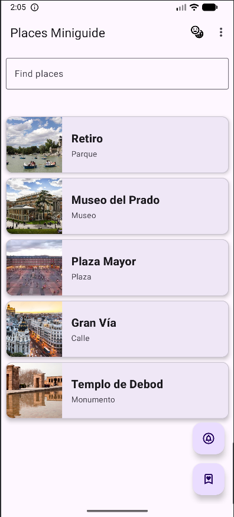
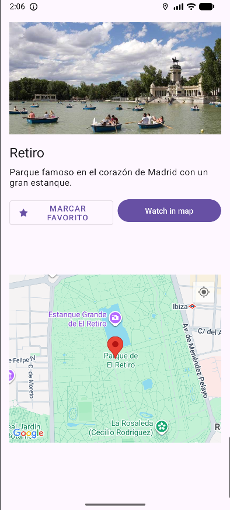
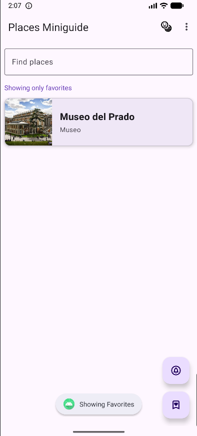

# Miniguía de Lugares 📍

Una aplicación Android desarrollada en Java para gestionar una lista de lugares de interés, con soporte para favoritos, notificaciones programadas y multi-idioma (Español/Inglés).

## 🚀 Cómo ejecutar la aplicación
1. **Clonar el repositorio** o descargar el código fuente.
2. Abrir el proyecto con **Android Studio** (versión Ladybug o superior recomendada).
3. Asegurarse de tener instalado el **SDK de Android 34** (o superior).
4. Sincronizar el proyecto con Gradle (**File > Sync Project with Gradle Files**).
5. Ejecutar en un **emulador** (Pixel 5 API 33+) o un **dispositivo físico** con depuración USB activada.

## 📱 ¿Qué hace la aplicación?
La app permite descubrir lugares turísticos mediante las siguientes funciones:
- **Listado de Lugares:** Visualización en un `RecyclerView` con carga de datos desde un archivo JSON local y persistencia en base de datos SQLite.
- **Búsqueda en tiempo real:** Filtro dinámico por nombre mediante un `TextWatcher`.
- **Gestión de Favoritos:** Posibilidad de marcar lugares como favoritos y filtrar la lista para ver solo estos.
- **Detalle del Lugar:** Pantalla secundaria con información extendida, imagen y ubicación.
- **Multi-idioma:** Cambio de interfaz entre Español e Inglés con persistencia en `SharedPreferences`.
- **Notificaciones:** Programación de un recordatorio diario mediante `AlarmManager`.

## 📸 Capturas de pantalla
| Lista Principal |       Detalle del Lugar       |      Filtro Favoritos       |
| :---: |:-----------------------------:|:---------------------------:|
|  |  |  |
*(Sustituye estas rutas por las imágenes en tu carpeta de proyecto)*

## 💡 Decisiones importantes

### 1. Persistencia de Datos
Se ha optado por un enfoque híbrido:
- **JSON:** Se usa como semilla inicial de datos.
- **SQLite (DbManager):** Una vez cargado el JSON, la app trabaja contra la base de datos para permitir que el estado de "favorito" sea persistente.
- **SharedPreferences:** Se utiliza para guardar la configuración del usuario (idioma y estado del filtro de favoritos) para que se mantengan al cerrar la app.

### 2. Ciclo de Vida y Rendimiento
Se ha implementado la lógica de carga en el método `onResume` para asegurar que, si el usuario marca un favorito en la pantalla de detalle y regresa, la lista principal se actualice automáticamente.

### 3. Cambio de Idioma Dinámico
Para evitar la mezcla de idiomas en la UI, se ha implementado un método `setLocale` que actualiza la `Configuration` de los recursos y reinicia la actividad con un `Intent` limpio (`FLAG_ACTIVITY_CLEAR_TASK`), asegurando que todos los componentes (incluido el Toolbar) se traduzcan correctamente.

## ⚡ Rendimiento (Android Profiler)
Tras ejecutar la aplicación con **Android Profiler**, se han extraído las siguientes conclusiones:

* **Riesgo detectado:** Durante la navegación rápida por la lista, se observaron picos en el uso de memoria RAM al cargar imágenes mediante URLs. Esto podría derivar en errores de *OutOfMemory* en dispositivos de gama baja si las imágenes son muy pesadas.
* **Mejora aplicada:** Se ha implementado `ExecutorService` con un `Handler` vinculado al `Looper.getMainLooper()`. Esto desplaza las operaciones de lectura/escritura de la base de datos a un hilo secundario, evitando que el hilo principal (UI Thread) se bloquee y garantizando una experiencia de usuario fluida (60 FPS).